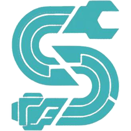
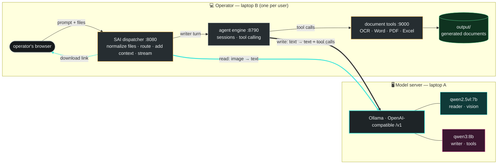
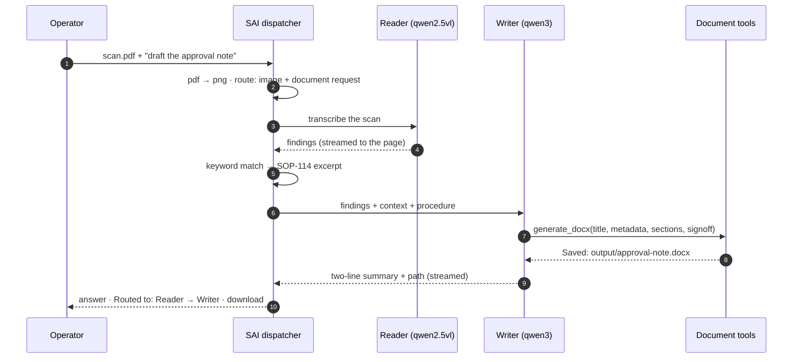
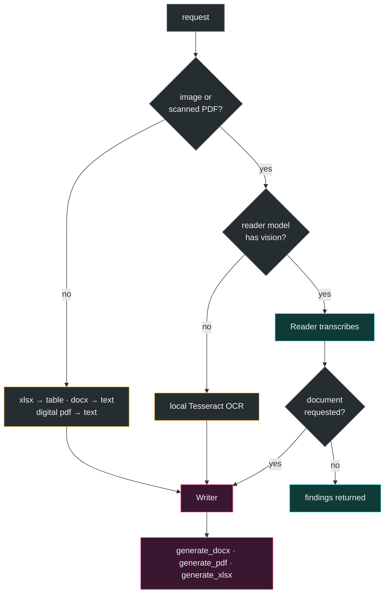

<p align="center"></p>

<h1 align="center">SAI — Sovereign Agentic Intelligence</h1>

<p align="center">
  
  
  
  
</p>

<p align="center">An on-premise, air-gapped AI workbench for confidential industrial documents.<br>
Reads scans, photos and spreadsheets. Writes approval notes as Word, PDF or Excel. Nothing leaves the building.</p>

## Purpose

Refineries and public-sector plants produce inspection reports, permits and readings that cannot be
sent to a cloud model. SAI runs two open-weight models on one laptop and an agentic pipeline on the
operator's laptop, so an engineer can drop in a scanned inspection report and get back a signed-off
approval note, with every byte staying on the LAN.

| | |
|---|---|
| **Automatic routing** | Each request goes to the model suited to it — a *reader* for images, a *writer* for text and documents — and the route is shown on every answer, with timings. |
| **Real deliverables** | `.docx`, `.pdf` and `.xlsx` files produced by tools, not text pasted into a chat. |
| **Provably offline** | The only network traffic is model inference to the server laptop. Tools, files and sessions never leave the operator's machine. |

## Architecture



The two thick links are the **only** traffic that crosses the cable. Everything else is localhost on
the operator's laptop.
## Demo


## How a request moves



## What gets routed where



## Run it

```bash
cd sovereign
scripts/run_all.sh prepare                                     # once, with internet: node, venv, engine, samples
scripts/run_all.sh start --ollama http://<model-laptop>:11434 --model qwen3:8b --vision-model qwen2.5vl:7b
```

Open **http://127.0.0.1:8080**. The starter actions attach the sample scan and spreadsheet from
`sovereign/samples/`. `restart` reloads after a code change, `status` shows what is up, `stop` shuts down.

## Repository

```
sovereign/                     everything SAI adds
  dispatcher/                    router, file normalization, direct reader, streaming page
  mcp_server/                    extract_from_scan · generate_docx · generate_pdf · generate_xlsx · list_outputs
  skills/                        the approval-note procedure the writer follows
  context/                       SOP and manual excerpts used for context
  scripts/                       prepare / start / restart / stop, model-server setup
ARCHITECTURE_sovereign_ai_workbench.md    full design, per-flow diagrams, setup order
PRD_sovereign_ai_workbench_v2.md          scope, decisions, acceptance criteria
```

The agent engine (sessions, tool calling, sandbox) lives under `packages/` and is used as-is
through its HTTP API; SAI does not modify it.
